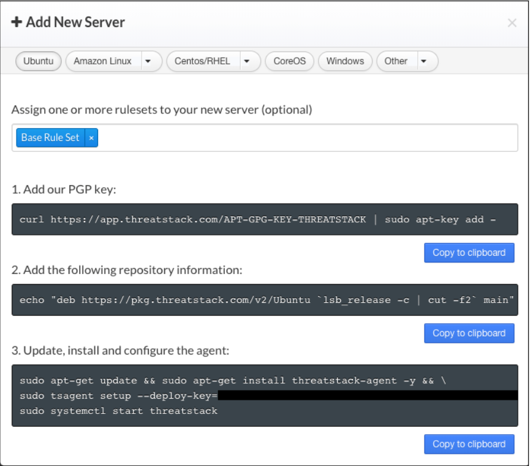

Threat Stack Agent
=====================================

Deploying Threat Stack 
----------------------
Before you install the Threat Stack host-based Agent, you must prepare your Linux distribution to work with the Agent. 

The Threat Stack host-based Agent uses the Linux Audit Framework to collect file, network, and process data.  

Check for other Agents
----------------------

.. note::

   Conflict can occur between the Threat Stack host-based Agent and other tools leveraging these kernels. Before deploying the Agent, ensure no other      tools that use these kernels. This is the result of a known Linux limitation where only one process can bind to the AuditD socket. 
   
Code Block To Check for Services leveraging audit

.. code-block::

   ps aux | grep audit

Code Block to Check for The Threat Stack Agent on the machine

.. code-block:: 
   
   sudo tsagent status

Install the Threat Stack Agent
------------------------------
*Prerequisites*

* Access to the Threat Stack Console
* Access to host either via CLI or RDP on a supported Operating System architecture(ARM or x86 architecture)
* Access to a supported browser (Chrome, Edge, Safi, and Firefox)

*Linux/Windows Distributions*

The Threat Stack application walks customers through an Agent install on the Servers page.

Log into Threat Stack > Click Servers. The Servers page displays. 

Select Agent 2.x+ The + Add New Server dialog displays. Proceed to the set of instructions below, specific to your Linux or Windows distribution. 

.. note::
   When deploying the Linux Agent for Ubuntu, you have the option of assigning a server name via the 'hostname' flag on step 3 of update, install and      configure the agent. Instead of the standard instructions provided by the UI, enter the following command to assign an easier to read name as opposed    to the LAN address of the machine. 
   
   
.. code-block::

   sudo tsagent setup --deploy-key=XXXXXXXXXXXXXXXX --ruleset="Base Rule Set" --hostname = "<Your Hostname>"

Container Distributions 
-----------------------
The Threat Stack Container Agent can be orchestrated using Kubernetes, Docker, and others. By default, the following rulesets are applied: 

* Base Rule Set 
* Docker Rule Set 
* Kubernetes Rule Set

Helm Chart 
----------

Helm is a package manager on top of Kubernetes. It facilitates installation, upgrades, and manages dependencies for the services you install in Kubernetes. 

*Prerequisites*

* Helm installed 
* Configured Values file 

Install the Threat Stack Helm Chart 
-----------------------------------

These instructions assume you already have Helm installed in your environment. It also assumes any Role-Based Access Control (RBAC) configuration has been completed for proper operation of Helm. Please see Installing Helm for instructions on installing Helm in your environment. 

.. code-block:: 
   
   hello world!
   

Uninstall the Helm Chart 
-------------------------
To uninstall the Helm chart, run the following command: 
.. code-block:: 
   
   hello world!
   

Remove an Agent 
---------------

To remove the Threat Stack Agent, follow your OS's normal software package removal option. The package was installed via Apt or Yum (even for the curl installer). 

For example: 

.. code-block:: 
   
   sudo systemctl stop threatstack
   
or

.. code-block:: 
   
   sudo dpkg -r threatstack-agent

