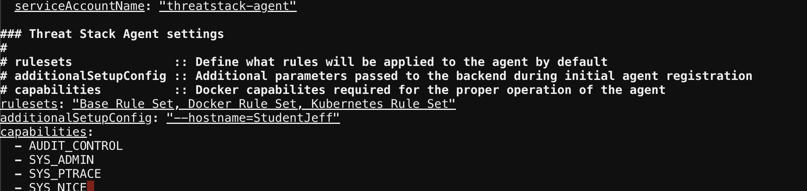
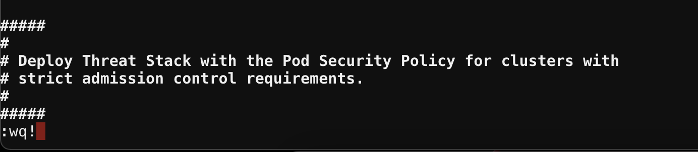

Threat Stack Containerized Agent
================================

Deploying the Threat Stack Agent 
--------------------------------

The Threat Stack Container Agent provides visibility into file, network, and process data from within pod or container orchestrated using Kubernetes, Docker, and others.

Container Distributions 
-----------------------
*Prerequisites*

* Access to the Threat Stack Console
* Access to host either via CLI or RDP on a supported Operating System architecture(ARM or x86 architecture)
* Access to a supported browser (Chrome, Edge, Safari, and Firefox)
 
.. note::
   Container enabled environments have the following rulesets by default.
   
   * Base Rule Set 
   * Docker Rule Set 
   * Kubernetes Rule Set
   

.. attention::
   **Challenge 8** – *Install the Threat Stack Container Agent*

Install using Helm  
^^^^^^^^^^^^^^^^^^

Helm is a package manager on top of Kubernetes. It facilitates installation, upgrades, and manages dependencies for the services you install in Kubernetes. 

*Prerequisites*

* Helm installed 
* Configured Values file 

.. warning::

   Use only the command provided to install the Threat Stack Container Agent. Using UDF, establish a Terminal session with the host labelled, **“K8S”**. 

Let's begin by downloading the values.yaml file used to configure the Helm Chart. 

.. code-block::

   wget https://raw.githubusercontent.com/threatstack/threatstack-helm/master/values.yaml 
   vim values.yaml 
 
In the values.yaml, lets update a couple things. First, the **hostname on line 51** so lab participants can track activity easily in the lab. Next, lets update the agentDeployKey on line 67 with your previously used key.

.. code-block::

   51 additionalSetupConfig: "--hostname=StudentN " 
   
.. code-block::

   67 agentDeployKey: "PROVIDED_DEPLOYKEY" 
   

Once you edit the necessary values, then exit by entering the following on vim to write and force quit.

.. code-block::

   :wq!
   

   

Now that we have our values.yaml file updated, lets deploy the Threat Stack Container Agent.  

.. code-block::

   helm repo add threatstack https://pkg.threatstack.com/helm 
   "threatstack" has been added to your repositories 

.. code-block::

   helm install threatstack-agent --values values.yaml threatstack/threatstack-agent 
   

Reload K8 Config 
^^^^^^^^^^^^^^^^

.. warning::

    Error: INSTALLATION FAILED: Kubernetes cluster unreachable: Get "http://localhost:8080/version": dial tcp 127.0.0.1:8080: connect: connection    refused 
   Note: kubectl config view --raw > ~/.kube/config
