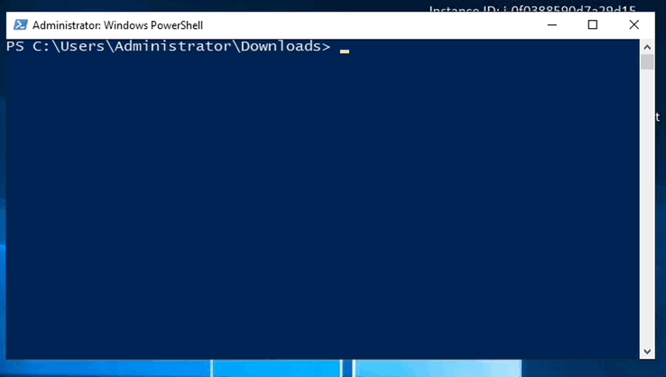

Threat Stack Windows Agent
==========================

Connecting to the Windows Machine
----------------------------------

First, select **'RDP'** pop up to download the .rdp file to connect to the Windows instance.

.. image:: _static/_rdp_connect.png
   :align: center
   :scale: 50%
   
Then, open the rdp file with your prefferred Microsoft RDP Desktop tool. You will be prompted requesting a password for the **'administrator'** user. The Windows instance password is found under the **'details/credentials'** tab of the UDF environment. Enter the password there into the RDP prompt.

Deploying the Threat Stack Windows Agent 
----------------------------------------

The Threat Stack windows-based Agent uses the Windows Events & Sysmon to collect file, network, and process data.

Install the Threat Stack Agent
-------------------------------
*Prerequisites*

* Access to the Threat Stack Console
* Access to host either via CLI or RDP on a supported Operating System architecture(ARM or x86 architecture)
* Access to a supported browser (Chrome, Edge, Safari, and Firefox)

Threat Stack automatically walks customers through an Agent install on the **Servers** page. Log into **Threat Stack > Click Servers**.

.. image:: _static/_ServerPages_Install.gif

Threat Stack automatically walks customers through an Agent install on the **Servers** page. Log into **Threat Stack > Click Servers**.

*Windows Distributions*

Select **+ Add New Server** and the Command Builder dialog will display. Select **Agent 2.X.X** to proceed to the set of instructions below, specific to your Windows distribution. 

.. attention::
   **Challenge 7** – *Install the Threat Stack Windows Agent*

Let’s begin by deciding the method of instalation, Wizard Install or PowerShell.

Wizard Install
^^^^^^^^^^^^^^^

Using the local browser, download the msi installer using this link: 

.. code-block::

   https://pkg.threatstack.com/v2/Windows/Threat+Stack+Cloud+Security+Agent.latest.msi

Navigate to the Downloads folder, now double click the **Threat+Stack+Cloud+Security+Agent.latest.msi**

Follow the images below for further details on utilizing the installation wizard.

Configure the Threat Stack Windows Agent. 

.. note::

   **Deployment Key**
   
   XXXXXXXXXXXXXXXX
   
   
   **Ruleset Name**
   
   Windows Rule Set

   
Finalize instalation. 

.. image:: _static/_Install_Windows_Deploy.png
   :align: center
   :scale: 75%
   
   
.. warning::
   Sysmon installation is completed separately

PowerShell 
^^^^^^^^^^

Open PowerShell and configure environmental variables for a streamlined lab. 

.. code-block::

   $Env:MY_DEPLOY_KEY="XXXXXXXXXXXXXX"
   $Env:MY_HOSTNAME="StudentN-Windows"

Download and install the Threat Stack Windows Agent. Then once install completes in a **new PowerShell** window > **tsagent status** 

.. code-block::

   cd 'C:\Users\Administrator\Downloads\'
   wget https://pkg.threatstack.com/v2/Windows/Threat+Stack+Cloud+Security+Agent.latest.msi -OutFile Threat+Stack+Cloud+Security+Agent.latest.msi
   msiexec /qn /i "C:\Users\Administrator\Downloads\Threat+Stack+Cloud+Security+Agent.latest.msi" TSDEPLOYKEY="$Env:MY_DEPLOY_KEY" TSHOSTNAME=$Env:MY_HOSTNAME

.. warning::
   Sysmon installation is completed separately

Sysmon Install
--------------

System Monitor (Sysmon) is a Windows system service that monitors and logs system activity. Freely available at the link below.

.. code-block::

   https://download.sysinternals.com/files/Sysmon.zip

Run the following commands from powershell/terminal:

.. code-block::

   wget https://download.sysinternals.com/files/Sysmon.zip -OutFile Sysmon.zip 
   Expand-Archive -Path 'C:\Users\Administrator\Downloads\Sysmon.zip' -DestinationPath 'C:\Users\Administrator\Downloads\Sysmon\' 
   cd 'C:\Users\Administrator\Downloads\Sysmon\' 
   wget https://raw.githubusercontent.com/SwiftOnSecurity/sysmon-config/master/sysmonconfig-export.xml -OutFile sysmonconfig-export.xml 
   sysmon -i sysmonconfig-export.xml 

 
.. code-block::

   tsagent config --set EventLogs "Security,Microsoft-Windows-Sysmon/Operational" 
   tsagent restart 
