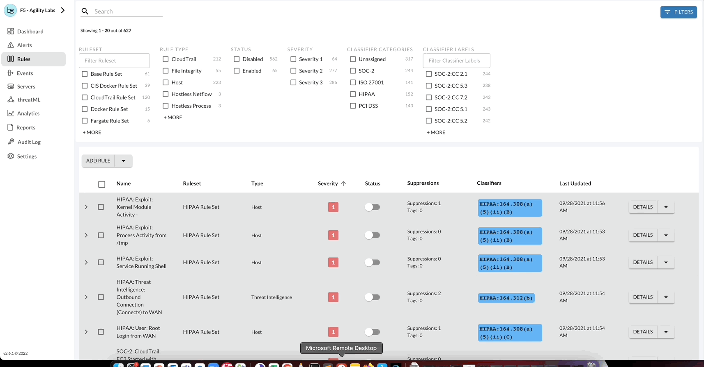

Threat Stack Cloud Security Platform®
*************************************

Threat Stack Cloud Security Platform® is a SaaS based application that supports host intrusion detection for both on premise as well as cloud workloads. Supporting most major linux distributions, Windows Server, as well as a variety of container runtimes including Docker and ContainerD to provide unparalleled visibility into your workloads. 

.. image:: _static/_Login.gif

.. attention:: 
 **Challenge 1** – *Access the Threat Stack Cloud Security Platform®*

 1. Navigate to the Threat Stack Cloud Security Platform: https://app.threatstack.com/login 
 2. In the Email field, type **StudentN@dadismad.com** as the email address and click Next. 
 3. In the Password field, type **1Amathre@t** as the password and click Next. 

.. note::
 Access to the Threat Stack Cloud Security Platform® is managed by the Lab Members.

Monitoring
-----------
By selecting **Servers Page**, you can filter or change information shown about servers, deploy Agents, and view a list of vulnerabilities found on the servers protected by the Agent. 

.. image:: _static/_ServerPages.gif

.. note::
 For a feature walthrough of the Servers Page navigate to: https://threatstack.zendesk.com/hc/en-us/articles/360055728251-Servers-Page 

Vulnerabilities
^^^^^^^^^^^^^^^
Threat Stack Agent retrieves a list of installed packages on the host each day and matches against all known Common Vulnerabilities & Exposures (CVEs) captured in the National Vulnerability Database (NVD). It then compares them against the published security notice and triage data from the specific Linux distribution. 

.. note::
 For a feature walthrough of Vulnerability Assessments navigate here: https://threatstack.zendesk.com/hc/en-us/articles/115001295270-Vulnerability-Assessment-Feature-Overview 

.. image:: _static/_ServerPages_Vulns.gif

AWS EC2 Inventory 
^^^^^^^^^^^^^^^
With an Amazon Web Service (AWS) profile integration, the user can see exactly what instances are protected and which are not. The Threat Stack Cloud Security PlatformⓇ (CSP) will always reflect the current state of your infrastructure through continuous scans for instance creation or termination, etc. 

.. image:: _static/_ServerPages_AllEC2.gif

.. attention:: 
 **Challenge 2** - *How To Review A Threat Stack Environment*
 
 Using the information acquired above, start developing context on the infrastructure by reviewing the **Servers** page.
 
 * Review an Agent
 * Review AWS EC2 Inventory
 * Review a vulnerability. 

Detection
---------

By selecting *Rules Page*, you can review all the included pre-built rules that monitor common threats to any infrastructure. Our rules have been created by our rules council & SOC team to monitor for the most common attack vectors our experts see on a continuous basis. Due to the complexities of modern infrastructure, we also provide customers with the ability to create custom rules. This provides you with the ability to monitor for behaviors that matter to your unique infrastructure. 

* **All Rules** can be created, updated, modified and deleted.

.. image:: _static/_RulesPage.gif

Rules Overview
^^^^^^^^^^^^^^^
Select the **Options** button to view available configurations for the rule selected. Following, to update or delete a rule, select the **Down Arrow > Edit Rule**.

.. image:: _static/_RulesPage_Drawer.gif

 
Rule Quick Actions
^^^^^^^^^^^^^^^^^^^^^
Additionally each rule (or group of rules) has available **quick actions** such as shifting the status of a rule. By shifting the **Status** of the rule, you can **Enable** or **Disable** the rule. Also, the rules page has more quick actions available such as bulk actions, filtering, and sorting. 

.. attention:: 
 **Challenge 3** – *How to use Threat Stack Rules*

 Using the information acquired above, start enabling rules based on goals, objectives or for general visibility. 
 **Clone any linux host Rule** and perform the following changes: 

 * **Rule Name**

    * User: **StudentN**: Privilege Escalations

 * **Alert Title**

    * User: **StudentN**: Privilege Escalation: auser: {{auser}} ran {{exe}} as user: {{user}} with {{arguments}} 

 * **Alert Description**

    * This rule is for StudentN alerts on privilege escalations using sudo and su. 

 * **Aggregate Fields**

    * auser, exe, user, arguments 

 * **Rule Filter**

    * (command = "sudo" or command = "su") and user != "root" and type = "start" and syscall = "execve" and tty != null 

**Rule Creation Example**

.. image:: _static/_RuleCreation_Example.gif
   
.. warning::
   If you copy and paste the above rule filter into the 'filter' section of the rule during the creation process. You will get an error due to syntax      differences in how the quotes are encoded in html versus typed out in the filter input.
   
.. note::
   For further details on Threat Stack Rules click here: https://threatstack.zendesk.com/hc/en-us/articles/4402570308877

Investigate
---------------------

.. image:: _static/_AlertPage.gif

By selecting Alerts, you’ll see an organized list sorted by severity, number of occurrences, and time of occurrence. Our rules are generated in real-time and have a retention period of 365 days. This can help you better track the abnormal spikes of alerts and review the behaviors that caused the events. Additional UI details are defined below. 

* **Tabs as focus areas**: We narrowed in on the well-known concept of browser tabs as focus areas, with in-built default tabs and the ability for customers to create and save their own tabs. Each tab can be customized to match the originating rulesets and/or originating servers (EC2 tags). 

* **Live alert loading**: The Alerts page displays alerts as they come in. It does not delay the loading of alerts coming into the Threat Stack Cloud Security PlatformⓇ (CSP). 

* **Search on alert titles**: All tabs have a "Filter by Title" search field. Results appear as the users type in the words in the search bar. 
 
.. attention:: 
 **Challenge 4** – *Investigate an Alert*
 
 Let’s put our Security Analyst hats on and start developing context surrounding the Alerts activity. 
 
 First let’s start by selecting any Alert. 
   * View in **Group View**
   * View in **List View**
   * View **Alert Context**

.. note::
 More detailed information about alert views refer to the documentation below: https://threatstack.zendesk.com/hc/en-us/articles/205992556-Alert-View

What is an Alert? 
^^^^^^^^^^^^^^^^^

Alerts are behavior anomalies elevated from the stream of raw telemetry by rule filters, that do not have a corresponding suppression.

Alert Lifecycle
^^^^^^^^^^^^^^^^

The following rule shows a Severity 1 event, where the Alert is reporting that Ptrace activity has been noted. As a Severity 1, the Threat Stack Cloud Security PlatformⓇ (CSP) uses machine learning (ML) to highlight occurrences of the event within 30 days. This is called Alert Context.

For more information as to why watch a Ptrace syscall, here is the MITRE ATT&CKS take on the subject: https://attack.mitre.org/techniques/T1055/008/ 

.. image:: _static/_AlertPage_AlertContext.gif

Generally, the alert lifecycle starts when you create a rule on the Threat Stack Rules page. 

1. Create a rule 
2. Maximize the effectiveness of that rule 
3. Review an alert 
4. Resolve an alert 

.. note:: 

   For further details on the Alert Lifecycle click here: https://threatstack.zendesk.com/hc/en-us/articles/211881823-Life-Cycle-of-an-Alert

.. attention:: 
 **Challenge 5** – *Trigger your StudentN Rule*
 
 Instinctively (or through this lab) you have created a rule. Apply the Alert Lifecycle to the rule. 

 * First let’s start by **reviewing the Rule**. 
    * Trigger the StudentN rule. 
    * Dismiss or Suppress the StudentN rule.
