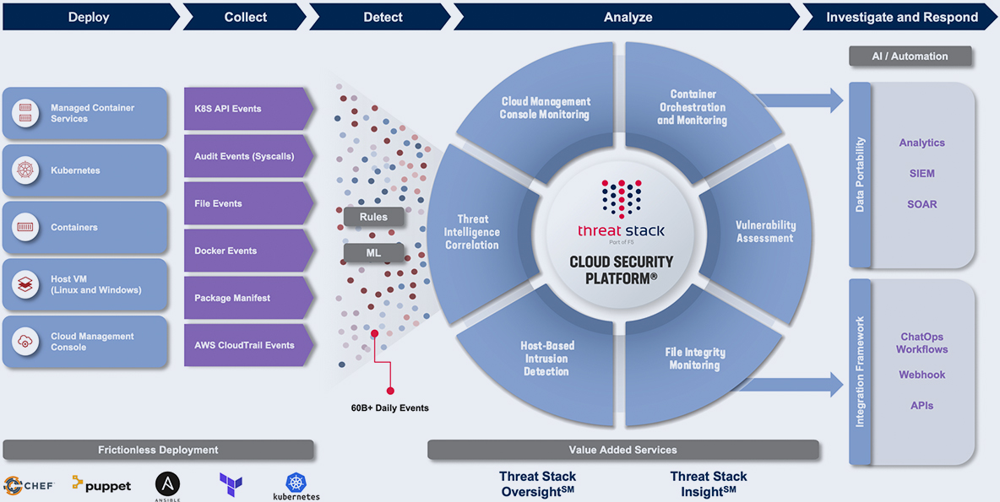

Welcome to F5 Application and Infrastructure Protection (Threat Stack's) Documentation!
=======================================================================================

**Threat Stack Cloud Security Platform**

Threat Stack’s high-efficacy threat detection combines standard rules and ML-based anomaly detection for uncovering both known and unknown threats in cloud-native infrastructure. Threat Stack provides customers with key capabilities and integrations to help overcome modern security and compliance challenges via: 

* `File Integrity Monitoring <https://www.threatstack.com/cloud-security-platform/file-integrity-monitoring>`_

* `Host-based Intrusion Detection <https://www.threatstack.com/cloud-security-platform/intrusion-detection>`_

* `Container & Kubernetes Security <https://www.threatstack.com/cloud-security-platform/container-security>`_

* `Vulnerability Assessment <https://www.threatstack.com/cloud-security-platform/vulnerability-assessment>`_

* `Cloud Management Console Monitoring <https://www.threatstack.com/use-cases/aws-security/cloudtrail-monitoring>`_

Additionally, we can become an extension of your security team via our co-managed services that are supported by human expertise. Our co-managed services are as follows: 

* `Threat Stack Oversight <https://www.threatstack.com/cloud-security-platform/oversight>`_ – 24/7/365 SOC support 

* `Threat Stack Insight <https://www.threatstack.com/cloud-security-platform/insight>`_ – Custom reports tailored to inform and prioritize risk reduction projects to improve your security program.

Check out the :doc:`Threat Stack Cloud Security Platform` section for further information

Contents
--------

.. toctree::
   Threat Stack Cloud Security Platform
   Threat Stack Agent
   Threat Stack Advanced Usage
   api
