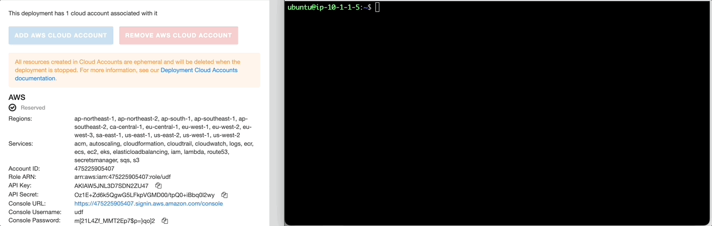

Threat Stack Playbooks
======================

Self-Protecting Cloud
---------------------

The following lab will be a culmination of all knowledge gained across both Threat Stack Labs. Our goal as integrators is to leverage the Threat Stack API and simple python code to enable a host to proactively respond to activity automatically.

In this section, validating the appropriate tools is important. 

*Prerequisites*

* Access to the Threat Stack Console
* Access to a Cloud Provider Account (AWS, Azure, GCP)
* Access to host via CLI supported Operating System Architecture(ARM or x86 architecture)
* Access to a supported browser (Chrome, Edge, Safari, and Firefox)

Validate Python & AWS CLI
^^^^^^^^^^^^^^^^^^^^^^

.. code-block::

   python3 -V 
   Python 3.8.10 

.. code-block::

   aws --version
   aws-cli/1.18.69 Python/3.8.10 Linux/5.13.0-1025-aws botocore/1.16.19 

.. code-block::

   tsagent status
      UP Threat Stack Agent Daemon
      UP Threat Stack Backend Connection
      UP Threat Stack Heartbeat Service
      UP Threat Stack Docker Monitoring
      UP Threat Stack Containerd Monitoring
      UP Threat Stack Network Tracer
      UP Threat Stack DNS Tracer
      UP Threat Stack Login Collector
      UP Threat Stack Log Scan Service
      UP Threat Stack Vulnerability Scanner
      UP Threat Stack Audit Collection
      UP Threat Stack File Integrity Monitor

.. warning::
   Using UDF, establish a terminal session with the host labelled, **Linux**
   
   
Python Bot Setup 
----------------
The following series of commands are meant to configure and set up the python bot. The python bot can be found in the home directory of the Linux host. 

Check AWS CLI 
^^^^^^^^^^^^^^
.. image:: _static/_AWS_ConfigCheck.gif

.. code-block::

  aws configure list 
  
      
Now that we have confirmed no active AWS CLI Configuration. Let's configure our **AWS CLI** and **AWS Networking Infrastructure**. 

Configure AWS CLI
^^^^^^^^^^^^^^^^^^
By typing **aws configure** as illustrated below, you navigate to **Cloud Accounts** in UDF. Here you will find the AWS credentials required, Access Key and AWS Secret Key.

Configure AWS Network Infrastructure
^^^^^^^^^^^^^^^^^^^^^^^^^^^^^^^^^^^^

Step 1: Create the VPC

.. code-block::

   aws ec2 create-vpc --cidr-block 10.0.0.0/16 

Step 2: Grab the NetworkAclId

.. code-block::

   aws ec2 describe-network-acls | grep NetworkAclId 
   "NetworkAclId": "acl-XXXXXXXXXXX" 

Step 1: Update Threat Stack Credentials File 

.. code-block::

   sudo vim credentials 
   [default] 
   ts_org=ORG 
   ts_user=USER 
   ts_key=KEY 
   
Step 2: Copy and move credentials into created directory

.. code-block::

   mkdir ../.threatstack 
   cp credentials ../.threatstack 
   

Launch Python Bot
-----------------
Use the **RuleID** provided below to detect network outbound connection to WAN and then auto add the CIDR block to the **AWS NACL ID**. The AWS VPC will block the added CIDR Block in near-realtime. 

**RuleID: 654db236-e367-11ec-8b40-8bde98a291cb**

.. note::
   Rule can be found in **F5 - Agility Labs** > **Rules** > **Base Rule Set** > **Network: Outbound Connection (Connects) to WAN**

.. code-block::

   python3 .threatstack/integration.py --watchrule **RuleID** --aws_acl_id **ACLID** 

Execute Command 

.. code-block::
   
   curl dadismad.com
   

 

Terminal Results 
^^^^^^^^^^^^^^^^
The following is a sample of the resulting terminal activity from the command which executes the malware. 

.. code-block::

   Alert poll returned destination set() source [] to block at the firewall 
   Alert poll returned destination set() source [] to block at the firewall 
   Alert poll returned destination set() source [] to block at the firewall 
   Alert poll returned destination set() source [] to block at the firewall 
   Found address 159.89.83.187/32 in entry {'CidrBlock': '159.89.83.187/32', 'Egress': True, 'Protocol': '-1', 'RuleAction': 'deny', 'RuleNumber': 4} ,    skipping 
   Alert poll returned destination {'164.90.254.173/32', '159.89.83.187/32'} source [{'container': 'Host', 'address': '172.31.20.97'}, {'container':        'Host', 'address': '172.31.20.97/20'}] to block at the firewall 
   Found address 164.90.254.173/32 in entry {'CidrBlock': '164.90.254.173/32', 'Egress': True, 'Protocol': '-1', 'RuleAction': 'deny', 'RuleNumber': 5}    ,skipping 
   Found address 159.89.83.187/32 in entry {'CidrBlock': '159.89.83.187/32', 'Egress': True, 'Protocol': '-1', 'RuleAction': 'deny', 'RuleNumber': 4} ,    skipping
