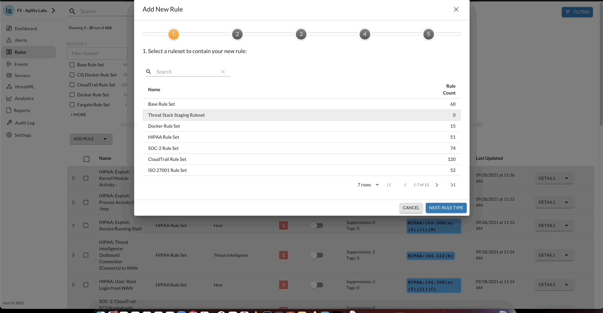

Threat Stack Playbooks
======================

Self-Protecting Cloud
---------------------

The following lab will be a culmination of all knowledge gained across both Threat Stack Labs. Our goal as integrators is to leverage the Threat Stack API and simple python code to enable a host to proactively respond to activity automatically.

In this section, validating the appropriate tools is important. 

*Prerequisites*

* Access to the Threat Stack Console
* Access to a Cloud Provider Account (AWS, Azure, GCP)
* Access to host via CLI supported Operating System Architecture(ARM or x86 architecture)
* Access to a supported browser (Chrome, Edge, Safari, and Firefox)

.. note::
   In UDF, establish a terminal session with the host labelled, **Linux**

Check Threat Stack Linux Agent
^^^^^^^^^^^^^^^^^^^^^^^^^^^^^^

.. code-block::

   tsagent status
      UP Threat Stack Agent Daemon
      UP Threat Stack Backend Connection
      UP Threat Stack Heartbeat Service
      UP Threat Stack Docker Monitoring
      UP Threat Stack Containerd Monitoring
      UP Threat Stack Network Tracer
      UP Threat Stack DNS Tracer
      UP Threat Stack Login Collector
      UP Threat Stack Log Scan Service
      UP Threat Stack Vulnerability Scanner
      UP Threat Stack Audit Collection
      UP Threat Stack File Integrity Monitor

Check Python 
^^^^^^^^^^^^^

.. code-block::

   python3 -V 
   Python 3.8.10 

Check AWS CLI 
^^^^^^^^^^^^^

.. code-block::

   aws --version
   aws-cli/1.18.69 Python/3.8.10 Linux/5.13.0-1025-aws botocore/1.16.19 

Check AWS CLI Config 
^^^^^^^^^^^^^^^^^^^

.. code-block::

  aws configure list 
  

.. image:: _static/_AWS_ConfigCheck.gif

Threat Stack Setup
------------------
Before jumping into the technical configuration on this lab, let us first define our detection rule within the Threat Stack Cloud Security Platform. For this Lab, our rule is intended to highlight network process activity. 

Setup Threat Stack Rule
^^^^^^^^^^^^^^^^^^^^^^^
Rule is precreated within Threat Stack's **F5 - Agility Labs** Organization, named **Self Protect: Network: Outbound Connection (Connects) to WAN**. Feel free to create a new rule or clone existing.

Setup Threat Stack Rule
^^^^^^^^^^^^^^^^^^^^^^^
Update the rule using the following criteria: 

* **Rule Name**

 * Self Protect: **StudentN**: Network: Outbound Connection (Connects) to WAN

* **Alert Title**

 * Self Protect: **StudentN**: Network: Outbound Connection (Connects) to WAN: {{exe}} ran by user {{user}} connected to {{dst_ip}}

* **Alert Description**

 * This alerts when a program connects to an external server's service.   An example is a wget/curl to an external HTTP server. This could be used for data exfiltration.  Depending on your environment this could be VERY noisy.   We recommend adding to the rule filter to focus scope of the rule.

* **Aggregate Fields**

 * user, exe, dst_ip 

* **Rule Filter**

 * event_type = "audit" and syscall = "connect" and (connection.dst_addr != "127.0.0.0/8" and connection.dst_addr != "::1/128" and connection.dst_addr != "::" and connection.dst_addr != "0.0.0.0" and connection.dst_addr != "169.254.0.0/16")

Enable Threat Stack Rule
^^^^^^^^^^^^^^^^^^^^^^^^
Using **Rule Quick** actions or by **editing the rule**, update the status of the rule to enable it.

.. image:: _static/_RulesPage_OnOff.gif

AWS CLI Setup
--------------
Now that we have confirmed no active AWS CLI accounts. Let's add our **AWS CLI Account** and setup the required **AWS Network**. 

Setup AWS CLI
^^^^^^^^^^^^^^
By typing **aws configure** as illustrated below, you navigate to **Cloud Accounts** in UDF. Here you will find the AWS credentials required, copy/paste both the **API Key** and **API Secret Key**.

.. note::
   In UDF, go to Deployments > Select **Threat Stack Labs** or name of deployment > Cloud Accounts. Here you will find the AWS keys such as; **API Key** and **API Secret Key**.

.. image:: _static/_AWS_AddConfig.gif

Setup AWS Network 
^^^^^^^^^^^^^^^^^^

Step 1: Create the VPC

.. code-block::

   aws ec2 create-vpc --cidr-block 10.0.0.0/16 

Step 2: Grab the NetworkAclId

.. code-block::

   aws ec2 describe-network-acls | grep NetworkAclId 
   "NetworkAclId": "acl-XXXXXXXXXXX" 
   
Setup Python Bot 
----------------
The following series of commands are intended to configure the python bot. The python bot can be found in the home directory of the Linux host. 

Step 1: Update Threat Stack Credentials File 

.. code-block::

   cd python-bot
   sudo vim credentials 
   [default] 
   ts_org=ORG 
   ts_user=USER 
   ts_key=KEY 
   
Step 2: Copy and move credentials into created directory

.. code-block::

   mkdir ../.threatstack 
   cp credentials ../.threatstack 
   

Launch Python Bot
-----------------
Use the **RuleID** provided below to detect network outbound connection to WAN and then auto add the CIDR block to the **AWS NACL ID**. The AWS VPC will block the added CIDR Block in near-realtime. 

**RuleID: 448889bf-eb81-11ec-b41e-1734e5d9feb0**
**ACL ID: acl-06ead5a200e17b7d4**

.. note::
   Rule can be found in **F5 - Agility Labs** > **Rules** > **Base Rule Set** > **Network: Outbound Connection (Connects) to WAN**

.. code-block::

   python3 .threatstack/integration.py --watchrule **RuleID** --aws_acl_id **ACLID** 

Execute Command 

.. code-block::
   
   curl dadismad.com
   

 

Terminal Results 
^^^^^^^^^^^^^^^^
The following is a sample of the resulting terminal activity from the command which executes the malware. 

.. code-block::

   Alert poll returned destination set() source [] to block at the firewall 
   Alert poll returned destination set() source [] to block at the firewall 
   Alert poll returned destination set() source [] to block at the firewall 
   Alert poll returned destination set() source [] to block at the firewall 
   Found address 159.89.83.187/32 in entry {'CidrBlock': '159.89.83.187/32', 'Egress': True, 'Protocol': '-1', 'RuleAction': 'deny', 'RuleNumber': 4} ,    skipping 
   Alert poll returned destination {'164.90.254.173/32', '159.89.83.187/32'} source [{'container': 'Host', 'address': '172.31.20.97'}, {'container':        'Host', 'address': '172.31.20.97/20'}] to block at the firewall 
   Found address 164.90.254.173/32 in entry {'CidrBlock': '164.90.254.173/32', 'Egress': True, 'Protocol': '-1', 'RuleAction': 'deny', 'RuleNumber': 5}    ,skipping 
   Found address 159.89.83.187/32 in entry {'CidrBlock': '159.89.83.187/32', 'Egress': True, 'Protocol': '-1', 'RuleAction': 'deny', 'RuleNumber': 4} ,    skipping
