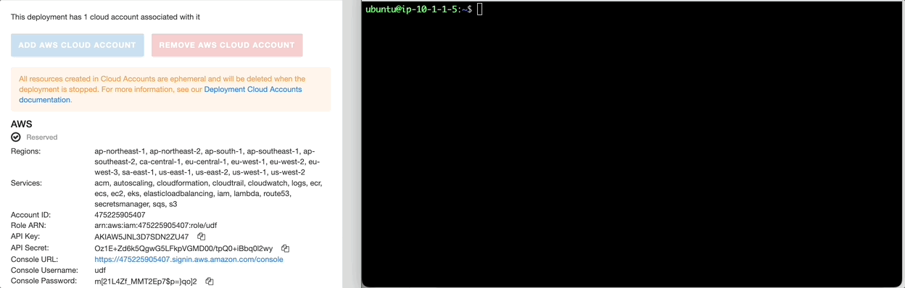

Threat Stack Playbooks - Part 1
===============================

Self-Protecting Cloud - Part 1
------------------------------

**Initial Configuration**

The following lab will be a culmination of all knowledge gained across both Threat Stack Labs. Our goal as integrators is to leverage the Threat Stack API and simple python code to enable a host to proactively respond to activity automatically.

In this section, validating the appropriate tools is important. 

*Prerequisites*

* Access to the Threat Stack Console
* Access to a Cloud Provider Account (AWS, Azure, GCP)
* Access to host via CLI supported Operating System Architecture(ARM or x86 architecture)
* Access to a supported browser (Chrome, Edge, Safari, and Firefox)

.. note::
   In UDF, establish a terminal session with the host labelled, **Linux**

Check Threat Stack Linux Agent
^^^^^^^^^^^^^^^^^^^^^^^^^^^^^^

.. code-block::

   tsagent status
      UP Threat Stack Agent Daemon
      UP Threat Stack Backend Connection
      UP Threat Stack Heartbeat Service
      UP Threat Stack Docker Monitoring
      UP Threat Stack Containerd Monitoring
      UP Threat Stack Network Tracer
      UP Threat Stack DNS Tracer
      UP Threat Stack Login Collector
      UP Threat Stack Log Scan Service
      UP Threat Stack Vulnerability Scanner
      UP Threat Stack Audit Collection
      UP Threat Stack File Integrity Monitor

Check Python 
^^^^^^^^^^^^^

.. code-block::

   python3 -V 
   Python 3.8.10 

Check AWS CLI 
^^^^^^^^^^^^^

.. code-block::

   aws --version
   aws-cli/1.18.69 Python/3.8.10 Linux/5.13.0-1025-aws botocore/1.16.19 

Check AWS CLI Config 
^^^^^^^^^^^^^^^^^^^

.. code-block::

  aws configure list 
  

.. warning::
   In UDF, if the **Linux** system doesn't have the **Threat Stack Linux Agent**, **Python**, or **AWS CLI** inform a Lab member before continuing.
