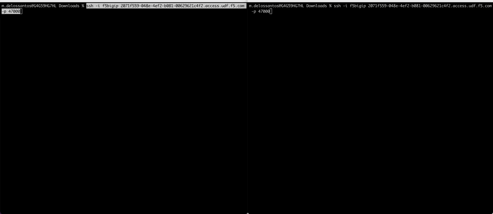
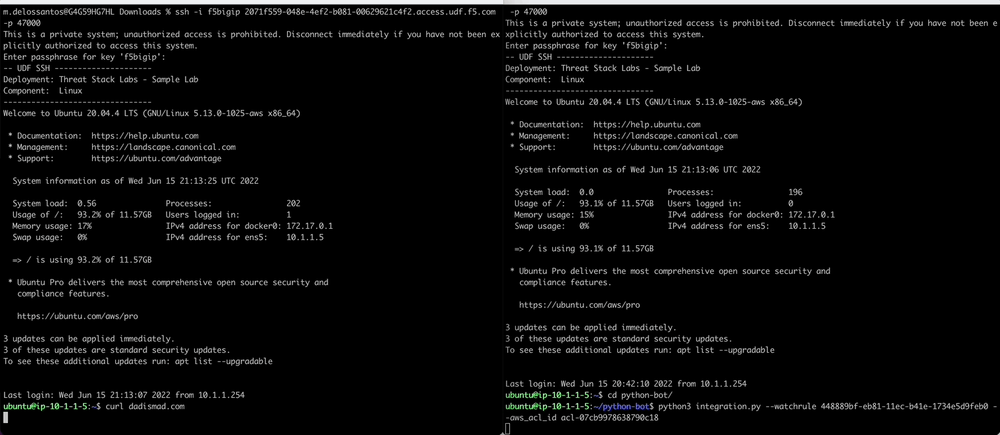

Threat Stack Playbooks - Part 3
===============================

Self-Protecting Cloud - Part 3
------------------------------
   
Setup Python Bot 
^^^^^^^^^^^^^^^^
The following series of commands are intended to configure the python bot to communicate with the Threat Stack API. The python bot can be found in the home directory of the Linux host. 

Step 1: Update Threat Stack Credentials File 

.. code-block::

   cd /home/ubuntu/python-bot
   sudo vim credentials 

.. code-block::
   [default] 
   ts_org=TS_ORGANIZATION_ID 
   ts_user=TS_USER_ID 
   ts_key=TS_API_KEY 
   
Step 2: Copy and move credentials into created directory

.. code-block::

   mkdir ../.threatstack 
   cp credentials ../.threatstack 
   

Launch Python Bot
^^^^^^^^^^^^^^^^
Use the **RuleID** provided below to detect network outbound connection to WAN and then auto add the CIDR block to the **AWS NACL ID**. The AWS VPC will block the added CIDR Block in near-realtime. 

* **RuleID: 448889bf-eb81-11ec-b41e-1734e5d9feb0**
* **ACL ID: acl-06ead5a200e17b7d4**

Be aware that the **RuleID** below is a **VALID** and can be found in **F5 - Agility Labs** > **Rules** > **Base Rule Set** > **Network: Outbound Connection (Connects) to WAN**. 

.. warning::
   In UDF, **Linux** instance python bot may require **pip3 install boto3** or **pip3 install --upgrade awscli**
   

.. code-block::

   python3 .threatstack/integration.py --watchrule **RuleID** --aws_acl_id **ACLID** 

The python bot will now watch for the RuleID to be triggered. *Leave terminal connected, and **start a new terminal session**.

.. code-block::
   Alert poll returned destination set() source [] to block at the firewall 
   Alert poll returned destination set() source [] to block at the firewall 
   Alert poll returned destination set() source [] to block at the firewall 
   Alert poll returned destination set() source [] to block at the firewall 

Results
^^^^^^^

**New Terminal**

In a new terminal we will sample activity from the python bot observing the rule. Once the rule triggers, the python bot grabs the destination/source IPs from the alert (and any contributing event) to then add them to the AWS VPC ACL using the AWS CLI. 

Execute Command to trigger the **RuleID**

.. code-block::
   
   curl dadismad.com

