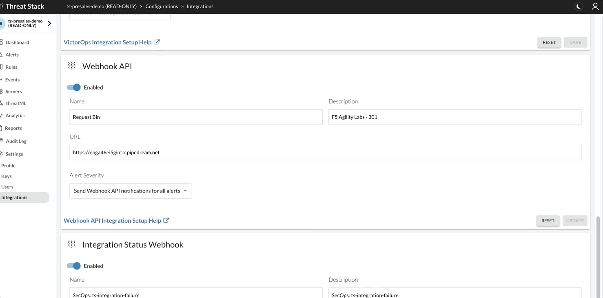

Threat Stack API
================

Threat Stack offers two types of APIs – Webhooks and REST API. The Webhooks API pushes trigger-based alerts to a specific URL and allows Threat Stack users to operationalize the alerts in near-real time. Meanwhile, the REST API allows the user to write queries to access Threat Stack information about organization-specific security concerns. 

 

* Alert Webhooks 

* RESTful API 

Webhook API 
-----------

