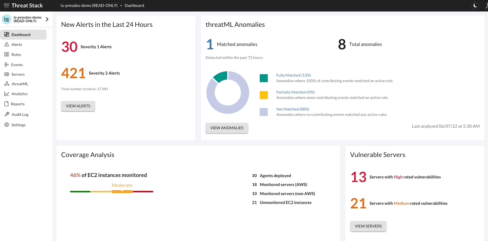

ThreatML
========

Threat Stack with ThreatML predicts the future behavior of your infrastructure through two different data models. These data models collect 30 days of specific information from your infrastructure to create a baseline of normal, predictable behavior. After ThreatML establishes a baseline, once per day it compares your baseline to your current infrastructure and reports any behavior that deviates from the models' predictions as anomalous. 

*Challenge 1 – Review Anomalies*

Note: Anomalies may not be present  

1. Navigate to the Threat Stack Cloud Security Platform: https://app.threatstack.com/login 
2. In the Email field, type your account email address and click Next. 
3. In the Password field, type your account password and click Next. 
4. Select threatML in the navigation bar or View Anomalies from the dashboard 

.. codeblock::

  For the lab enter: StudentN@dadismad.com

  for the lab enter: XXXXXXXXXXX
