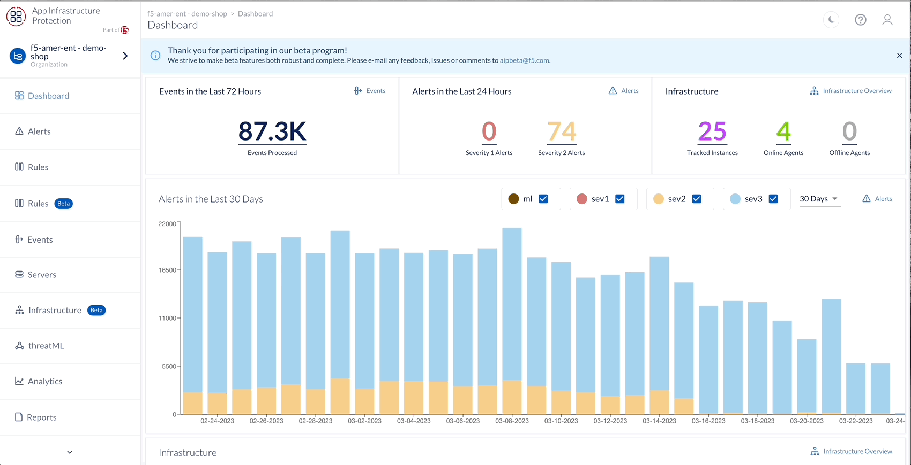

ThreatML
========

AIP with ThreatML predicts the future behavior of your infrastructure through two different data models. These data models collect 30 days of specific information from your infrastructure to create a baseline of normal, predictable behavior. After ThreatML establishes a baseline, once per day it compares your baseline to your current infrastructure and reports any behavior that deviates from the models' predictions as anomalous. 

.. note:: Anomalies may not be immediately viewable

.. attention:: 
 **Challenge 1** – *Review Anomalies*

1. Navigate to the AIP Dashboard 
2. Select threatML on the left side bar  
