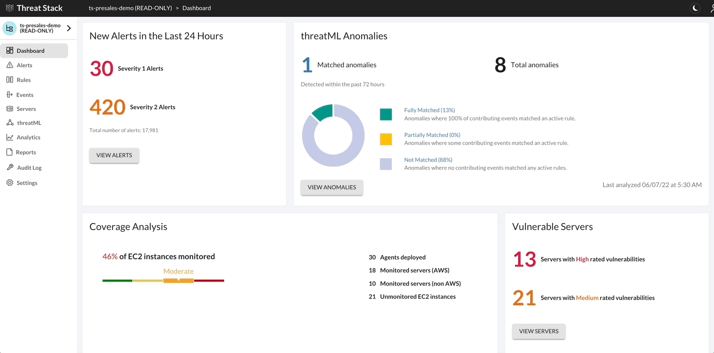
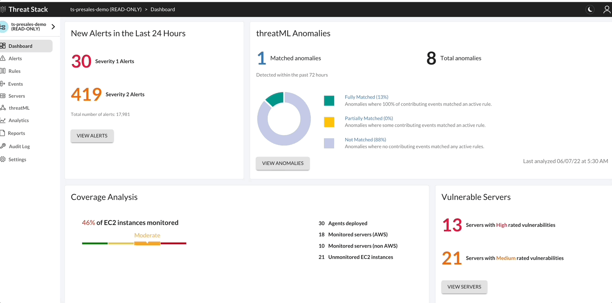

Threat Stack API
================

Threat Stack offers two types of APIs – **Webhooks API** and **RESTful API**. 

* The **Webhooks API** pushes trigger-based alerts to a specific URL and allows Threat Stack users to operationalize the alerts in near-real time. 
* The **RESTful API** allows the user to write queries to access Threat Stack information about organization-specific security concerns. 
 

Webhook API 
-----------

Webhooks allow Threat Stack users to send trigger-based alerts to a specific URL and operationalize the alert data in near-real time. Threat Stack sends alert details in JSON format through HTTPS Post. A third-party service – such as Slack, Zapier, webhooks.io, or IFTTT – to integrate Threat Stack Alert Webhooks into your existing applications and workflows 

To view the Webhook configuration, you can find these in the **Threat Stack UI > Settings > Integrations**

.. note:: 

   Webhook sends alerts through HTTPS POST, the Webhook URL must be HTTPS.
   
   
.. image:: _static/_Integrations_Webhook_LiveEx.gif

.. attention::
   **Challenge 2** – *Review Webhook*

   1. Navigate to the Threat Stack Cloud Security Platform: https://app.threatstack.com/login 
   2. Select **Settings > Integrations** in the navigation bar 
   3. Scroll to the **Webhook API** section 
   4. Click this link to review the events sent to Request Bin: https://requestbin.com/r/enga46ei5gint/ 

RESTFul API 
-----------

The Threat Stack API using RESTful principles with predictable, resource-oriented URL, and Response Codes. The Threat Stack API manages endpoints via the standard HTTP methods.  

All requests for the API use the same host: 

.. code-block::

   https://api.threatstack.com/v2/ 
   

.. image:: _static/_APIDOCS.gif

Configuring API Environment
^^^^^^^^^^^^^^^^^^^^^^^^^^^

The variables below are required to authenticate against the Threat Stack Security Platform using HAWK Authentication. This section generalizes the parameters, but each section below specifies its proper application per configuration. 

Environmental Variables
^^^^^^^^^^^^^^^^^^^^^^^^

Let’s begin by gather these variables, you can find these in the **Threat Stack UI > Settings > Application Keys**

**Key variables and their meaning**

* **TS_USER_ID / HAWK Auth ID** - User ID of the API key holder 

* **TS_API_KEY / HAWK Auth Key** - API key for the user specified by TS_USER_ID 

* **TS_ORGANIZATION_ID / HAWK Ext** - Organization ID of the organization to access 

.. note::

   We **recommend using our UDF Linux Host** but any host with python will work.  

.. attention::
   **Challenge 3** – *Configure API & First Request*

1. Clone a copy of Threat Stack API Scripts from GitHub: https://github.com/threatstack/threatstack-api-scripts.git 

.. code-block:: 

   git clone https://github.com/threatstack/threatstack-api-scripts.git 
   cd threatstack-api-scripts
   
2. Install Python Script Requirements 

.. code-block:: 

   sudo pip3 install -r requirements.txt 
   
   
You might have to install pip3 if the instance (or local machine) doesn’t have it. 

.. note::
   sudo apt install python3-pip 

3. Navigate to the clone GitHub directory, specifically **GetAllAgents**. 

.. code-block:: 

   cd GetAllAgents 
   

4. Edit the **threatstack.cfg.sample** to update [USER_INFO] and [DEFAULT] with your 
   **TS_USER_ID**, **TS_API_KEY**, and **TS_ORG_ID**. 

.. code-block:: 

   vim threatstack.cfg.sample  
   
5. Rename **threatstack.cfg.sample** to **threatstack.cfg** in the same directory
   
.. code-block:: 

   cp threatstack.cfg.sample threatstack.cfg 

6. Run it!

.. code-block:: 

   python3 get_agents.py
   
**Results**
.. code-block:: 

   Returned 30 agents. 
   30 agents written to file. 
   

