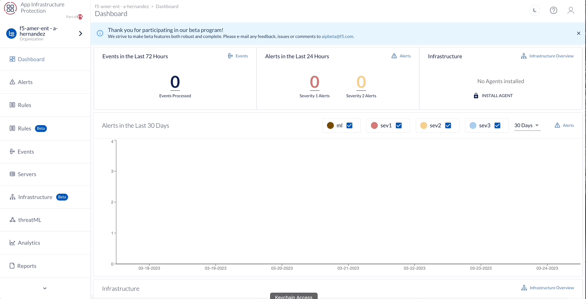
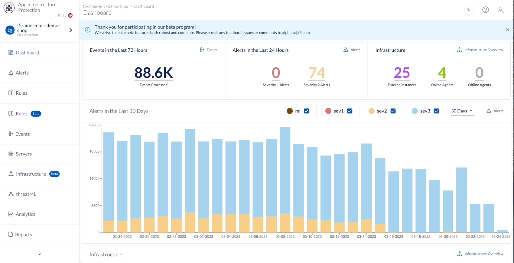

AIP API
================

AIP offers two types of APIs – **Webhooks and RESTful API**. The Webhooks API pushes trigger-based alerts to a specific URL and allows AIP users to operationalize the alerts in near-real time. Meanwhile, the REST API allows the user to write queries to access AIP information about organization-specific security concerns. 

 

* Alert Webhooks 

* RESTful API 

Webhook API 
-----------

Webhooks allow AIP users to send trigger-based alerts to a specific URL and operationalize the alert data in near-real time. AIP sends alert details in JSON format through HTTPS Post. 

* Using the Alert Webhooks API requires: 

* webhook network access (whitelisting) 

a third-party service – such as Slack, Zapier, webhooks.io, or IFTTT – to integrate AIP Alert Webhooks into your existing applications and workflows 

.. note:: 

   *Important Note*: Webhook sends alerts through HTTPS POST, the Webhook URL must be HTTPS. 
   
.. attention:: 
 **Challenge 2 – Review Webhook**

1. Navigate to the Application Infrastructure Protection dashboard 
2. Select Settings > Integrations in the navigation bar 
3. Scroll to the Webhook API section 
4. Click this link to review the events sent to Request Bin: https://requestbin.com/r/enga46ei5gint/ 

.. image:: _static/_Integrations_Webhook_LiveEx.gif

RESTFul API 
-----------

.. image:: _static/apidocs_v2.gif

The AIP API using RESTful principles with predictable, resource-oriented URL, and Response Codes. The AIP API manages endpoints via the standard HTTP methods.  

All requests for the API use the same host: 

.. code-block::

   https://api.threatstack.com 
   
**Configuring API Environment**

The variables below are required to authenticate against the AIP Security Platform using HAWK Authentication. This section generalizes the parameters, but each section below specifies its proper application per configuration. 

**Environmental Variables**

Let’s begin by gathering these variables, you can find these in the **AIP UI > Settings > Keys**

**Key variables and their meaning**

* **TS_USER_ID / HAWK Auth ID** - User ID of the API key holder 

* **TS_API_KEY / HAWK Auth Key** - API key for the user specified by TS_USER_ID 

* **TS_ORGANIZATION_ID / HAWK Ext** - Organization ID of the organization to access 

.. note:: 
   We **recommend using our UDF Linux Host** for the next challenge but any host with python will work.

.. attention:: 
 **Challenge 3 – Configure API & First Request**

1. Clone a copy of AIP API Scripts from GitHub: https://github.com/threatstack/threatstack-api-scripts.git 

.. code-block:: 

   git clone https://github.com/threatstack/threatstack-api-scripts.git 
   cd threatstack-api-scripts
   
2. Install Python Script Requirements 

.. code-block:: 

   sudo pip3 install -r requirements.txt 
   Note: You might have to install pip3 if the instance (or local machine) doesn’t have it. 
   sudo apt install python3-pip 

3. Navigate to the clone GitHub directory, specifically **GetAllAgents**. Edit the **threatstack.cfg.sample** to update with your **TS_USER_ID**, **TS_API_KEY**, and **TS_ORG_ID** under the [USER_INFO] and [DEFAULT] sections of the text file.

.. code-block:: 

   cd GetAllAgents 
   vim threatstack.cfg.sample  
   cp threatstack.cfg.sample threatstack.cfg 
  
  
4. Run it!

.. code-block:: 

   python3 get_agents.py 
   Returned 30 agents. 
   30 agents written to file. 
   

